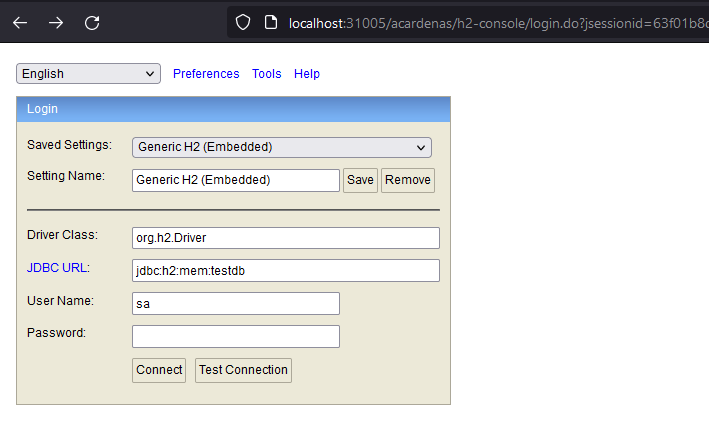

# API Cliente

Servicio que devuelve el cliente por el `codigoUnico`. Además, registra y actualiza el cliente.

### Introducción
El servicio está construido con `JAVA 8`, `Spring Boot`, Base de datos `H2` y `Docker`.

### Cómo iniciar con docker
En orden para iniciar el proyecto:
```bash
$git clone git@github.com:acardenasr6/api_cliente.git

# compilación del proyecto
$ mvn clean install 

# iniciar el proyecto
$  docker-compose up -d
```
#### 

### Accedo a la base de datos H2
- Url -> `http://localhost:31005/acardenas/h2-console/`
- JDBC_URL: `jdbc:h2:mem:testdb` 
- User Name: `sa` 
- Password: `acardenas`



### Cómo consumir el servicio
- REGISTRAR CLIENTE
    ```bash
    Método -> POST 
    Ruta   -> http://localhost:31005/acardenas/clientes
    ```
  - Request
  ```bash
  {
    "codigoUnico": "CL001",
    "nombres": "Armando",
    "apellidos": "Cardenas Rios",
    "tipoDocumento": "DNI",
    "numeroDocumento": "78541521"
  }
  ```
  - Response 
   ```bash
  Status: 200

  {
    "path": "/acardenas/clientes",
    "status": 200,
    "data": true
  }
  ```
    ```bash
  Status: 400

  {
    "path": "/acardenas/clientes",
    "status": 400,
    "apiError": {
      "typeClass": "acardenas.com.exception.ValidationException",
      "message": "¡El cliente ya existe!",
      "errorTrack": {
        "methodName": "registrar",
        "fileName": "ClienteServiceImpl.java",
        "lineNumber": 31,
        "className": "acardenas.com.service.impl.ClienteServiceImpl",
        "nativeMethod": false
      }
    }
  }
  ```
- OBTENER CLIENTE
  ```bash
    Método -> GET 
    Ruta   -> http://localhost:31005/acardenas/clientes?codigo=CL001
    ```
  - Response
   ```bash
  Status: 200

  {
    "path": "/acardenas/clientes",
    "status": 200,
    "data": {
      "id": 1,
      "codigoUnico": "u001",
      "nombres": "Armando",
      "apellidos": "Cardenas Rios",
      "tipoDocumento": "DNI",
      "numeroDocumento": "78541521"
    }
  }
  ```

